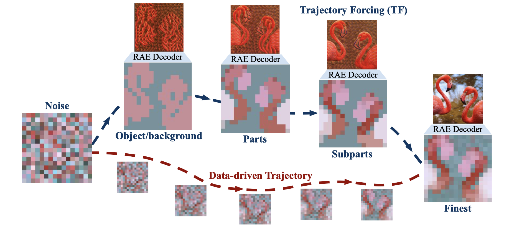
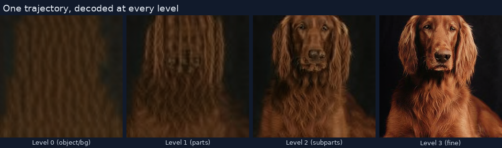
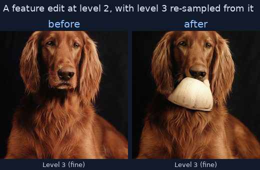

<div align="center">


# ComfyUI-TrajectoryForcing

**Coarse-to-fine image generation you can look inside, edit, and re-sample, as a node graph.**

[](https://github.com/KorayUlusan/ComfyUI-TrajectoryForcing/actions/workflows/tests.yml)
[](LICENSE)
[](https://www.python.org/)
[](https://github.com/comfyanonymous/ComfyUI)
[](https://mervekocabas.github.io/TrajectoryForcing/)



<sub>From the Trajectory Forcing paper (Kocabas et al., ECCV 2026). Each box along the top is a `TF_LEVELS` socket you can preview, edit, and resume from.</sub>

</div>

---

[Trajectory Forcing](https://mervekocabas.github.io/TrajectoryForcing/) builds an
image in four passes through a hierarchical DINOv2 latent space: object and
background, then parts, then subparts, then the finest tokens. One network
evaluation each. The RAE decoder is frozen and works at any point in that space,
so **every intermediate level decodes to a picture**.

That turns generation into a DAG with visible intermediates and a feedback edge.
You can edit a level, re-sample the ones above it, and keep the ones below. Which
is a node graph.

| | |
|---|---|
|  |  |
| One trajectory, all four levels | Before and after an edit at level 2 |

> New to ComfyUI? [**docs/GETTING-STARTED.md**](docs/GETTING-STARTED.md) assumes
> nothing and gets you to your first edit.

---

## Install

> [!IMPORTANT]
> This extension needs its own Python environment. It runs a JAX model inside the
> ComfyUI process, and TrajectoryForcing's JAX stack coexists with ComfyUI's torch
> at exactly one torch version. `requirements.txt` is empty on purpose, so that
> installing through ComfyUI Manager cannot rewrite the torch your other nodes
> depend on. A Manager install registers the nodes and then stops at *TF Load
> Pipeline* with the setup command.

```bash
git clone https://github.com/comfyanonymous/ComfyUI ~/ComfyUI
git clone https://github.com/KorayUlusan/ComfyUI-TrajectoryForcing ~/ComfyUI-TrajectoryForcing
ln -s ~/ComfyUI-TrajectoryForcing ~/ComfyUI/custom_nodes/ComfyUI-TrajectoryForcing

cd ~/ComfyUI-TrajectoryForcing
bash env/setup.sh     # ~10 min, ~11 GB
./run_comfyui.sh      # http://localhost:8188
```

Model code and weights are fetched on first use. Nothing else to download.

| | |
|---|---|
| **GPU** | NVIDIA, 8 GB VRAM minimum (12 GB comfortable) |
| **OS** | Linux. Windows via WSL2 only, since `jax[cuda12]` has no native-Windows wheels |
| **Disk** | ~11 GB environment plus ~13 GB weights |
| **Python** | 3.11 |

<details>
<summary><b>Measured VRAM</b>: 6.6 GiB peak, and where it goes</summary>

From `scripts/measure_resources.py` on an H100, for the full editing workflow
(5.3 GiB host RAM):

| stage | VRAM |
|---|---|
| model loaded | 2.5 GiB |
| + first generate (compiles XLA) | 4.6 GiB |
| + RAE decoder built | 6.6 GiB |
| full edit, two trajectories held | 6.6 GiB |

That is TrajectoryForcing's share only. On an 8 GB card, keep this the only model
in the graph.
</details>

<details>
<summary><b>On a Slurm cluster</b></summary>

```bash
./run_comfyui_slurm.sh          # allocates a GPU, streams the log, Ctrl-C cancels
```

It uses `srun` rather than `sbatch`, so quitting does not strand an allocation.
ComfyUI binds the *compute* node, so the script also bridges the login node's
`localhost:PORT` to it with `ncat`. That way you need no SSH hop to the compute
node. From your laptop:

```bash
ssh -N -L 8188:localhost:8188 <user>@<login-node>
```

Or nothing at all under VS Code Remote.

Set `TF_PARTITION`, `TF_QOS` and `TF_TIME` in `.env`. There are no defaults,
because a partition name is a property of your cluster (`sinfo -s`,
`sacctmgr show qos format=name`).

Batch jobs go through `./slurm/submit.sh slurm/gpu_smoke.sbatch`, which passes
those two on the command line. `#SBATCH` lines cannot read a variable, so they are
the one setting a job file cannot carry portably.
</details>

<details>
<summary><b>Configuration</b>: every path, in one file</summary>

Nothing has to be set if ComfyUI, the venv and this extension are where
`env/setup.sh` puts them. Otherwise copy the template rather than editing scripts:

```bash
cp .env.example .env      # gitignored; every script sources it
```

| variable | default | set it when |
|---|---|---|
| `WORK` | `$HOME` | ComfyUI, venv and caches live elsewhere. The rest derive from it. |
| `COMFY_DIR` | `$WORK/ComfyUI` | your ComfyUI is elsewhere |
| `COMFY_VENV` | `$WORK/.venvs/comfyui-tf` | you built the venv elsewhere |
| `TF_REPO` | found, else fetched | you have a TrajectoryForcing checkout to reuse |
| `TF_RAE_ROOT` | `$TF_REPO/checkpoints/rae` | you already have the 2 GB decoder |
| `TF_PARTITION` `TF_QOS` `TF_TIME` | none | any Slurm cluster |
| `TF_XLA_MEM_FRACTION` | unset | sharing the GPU with a large torch model |

Every line is written `KEY="${KEY:-default}"`, so `WORK=/scratch ./run_comfyui.sh`
still wins over the file.
</details>

<details>
<summary><b>Where TrajectoryForcing comes from</b>: fetched, pinned, not vendored</summary>

The model code is imported from upstream rather than copied, so this always runs
against their implementation. On startup the extension looks for a checkout in
order (`$TF_REPO`, a sibling directory, then inside itself) and fetches one only if
it finds none. An existing checkout always wins, which also avoids re-downloading
the 2 GB RAE decoder that lives inside it.

The fetch is pinned to a commit (`TF_REPO_COMMIT` in `tf_nodes/locate.py`) rather
than to `main`. This extension calls TF's API, so an upstream change is a change
here, and it should arrive with a deliberate bump instead of on a stranger's first
install.

It happens at ComfyUI startup rather than first generate, because the loader's
config dropdown and the ImageNet class list are built from the checkout while node
schemas are defined. Set `TF_NO_AUTO_FETCH=1` to turn it off.

Weights, both resolved on first use:

| what | where |
|---|---|
| flow checkpoint | `ComfyUI/models/trajectory_forcing/`, from a dropdown. `auto` downloads `TF_L_edit`. |
| RAE decoder | `TrajectoryForcing/checkpoints/rae/`, reused if present |
</details>

---

## Workflows

Five examples, each self-documenting on the canvas. Walkthrough:
[**workflows/README.md**](workflows/README.md).

| | what | runs as-is |
|---|---|---|
| `01-generate-and-decode` | the method, no editing | ✅ |
| `02-feature-edit-coords` | change a region's content | ✅ |
| `03-feature-edit-painter` | the same, with a brush | two runs by design |
| `04-shape-edit` | move a region's boundary | ✅ |
| `05-sweep-seeds` | one edit across four seeds, tabulated | ✅ |

---

## Nodes

Under **TrajectoryForcing** in the node menu. They are searchable by what they do,
so "paint", "mask", "diff", "region" and "seed" all find the right one.

#### Generate and look

| node | |
|---|---|
| **TF Load Pipeline** | Loads the flow model and RAE decoder. Cached for the process, with a progress bar across restore, compile and decoder build. |
| **TF ImageNet Class** | Class by name, id out. |
| **TF Generate** | Samples one trajectory. Outputs every level. |
| **TF Decode Levels** | RAE-decodes all levels, the final one, or one you name. |
| **TF Latent Preview (PCA)** | The token grid as PCA false colour. Much cheaper than decoding, and it shows the structure edits act on. |
| **TF Levels Info** | Shape, class, seed, edit history. |
| **TF Compare Levels** | What changed between two trajectories, per level and per token, as a table and a heatmap. |

#### Choose what to edit

Edits act on regions of a 16×16 token grid, which no ComfyUI mask tool knows
about. So **TF Level Canvas** renders a paintable level, core **Painter** supplies
the brush, and **TF Tokens From Mask** converts the result back to tokens.

| node | |
|---|---|
| **TF Level Canvas** | One level as a 512px canvas, with the grid, region boundaries and current selection drawn on. Feed it to Painter. |
| **TF Region Map** | Clusters tokens into connected regions by cosine similarity. These are the *R* in the paper's edits. Wire its `level` output into the edit node so the two cannot drift. |
| **TF Tokens From Mask** | Painted mask to tokens. Wire a region map in to snap a rough stroke to whole regions. |
| **TF Tokens From Coords** | Click a 16×16 grid on the node, or type `row,col` (`7,6:9` is a run). Both write the same text field, so a selection stays quotable in a writeup. |
| **TF Tokens Combine** | Union, intersect, difference, invert. |
| **TF Tokens Preview** | Draw a selection on its own, to check what a mask resolved to. |

#### Edit and resume

Both edits reduce to the paper's one primitive, `z̃ᵢ = f_src` for the selected
tokens, and differ only in where `f_src` comes from. Neither samples anything.
**TF Resume From Level** is what propagates the change.

| node | |
|---|---|
| **TF Feature Edit** | Target tokens take a feature from elsewhere, either the same trajectory or a second one. `region mean` is the paper's `f_src`; `token cycle` copies token-for-token. |
| **TF Shape Edit** | Hands boundary tokens to a neighbouring region, so its extent changes and its content does not. |
| **TF Resume From Level** | Re-samples every level above *l\**. Levels below are untouched, because sampling is Markov in the level index and an edit only propagates upward. |
| **TF Sweep Edit** | The whole chain, once per value of one axis, with everything else pinned. See below. |
| **TF Save / Load Levels** | A trajectory to and from `.npz`, with class, seed and history. |
| **TF Save Report** | Sweep and compare tables to `.md`, stamped with the run that produced them. |
| **TF Save Images** | Pictures to `.png` beside them, with class, seed and history in the PNG metadata. |

<details>
<summary><b>Four conventions</b></summary>

`-1` means "decide for me". A few advanced widgets take it, each labelled
`(-1 = auto)`, and the node reports what it chose:

```
resume from level 2 (auto: the level the edit wrote to); class 213 (auto: the
trajectory's own); seed 592
```

Every node shows its own result in its body: the edit summary, the region count,
the selection, the comparison table. Nothing needs a preview node to be read.

Measurements are text, not sockets. Tokens changed, peak distance, sweep spread
and region counts all live in the node body and in the `report` string. ComfyUI's
suggestion index skips ordinary INT and FLOAT inputs, so a drag from a number
output dead-ends in an empty menu. An output that *is* a socket, like a region
map's `level` or a class id, exists because a widget elsewhere receives it.

Several frames arrive as one image. ComfyUI pages a multi-image output behind a
small `1/4` button, so four decoded levels would look like level 0 alone. Anything
meant to be seen together is stitched into a contact sheet instead. `sheet_layout`
(advanced) switches back to a batch, which is the only shape *SaveImage* writes as
one file per frame.

About half of all widgets sit behind ComfyUI's advanced toggle. Turn on
*Settings → Always show advanced widgets* to see everything.
</details>

<details>
<summary><b>Sweeping</b>: what makes it an experiment rather than a batch button</summary>

**TF Sweep Edit** runs feature edit, resume and measure once per value of one axis
(`seed`, `level`, `strength`), with everything else pinned, so no two arms differ
in two ways at once.

Every arm gets its own baseline: the same trajectory resumed at the same level
with the same seed and no edit. Re-sampling from an edited canvas is still
sampling, so without that baseline "the image changed a lot" cannot be told apart
from "the seed changed a lot", and a seed sweep mostly measures the seed.

The spread across arms is the number to read. It is the mean pairwise cosine
distance at the final level. Near zero means the edit decides the outcome, so a
single-seed result was trustworthy. Large means the seed does, and it was not.

Wire a *TF Region Map* into `regions` and it sweeps a shape edit instead. A map
describes one level, so `seed` and `strength` stay available and `level` is
refused with that reason.

Sweeping *l\** is the one axis that cannot hold everything fixed, because a
selection snapped to one level's regions is not a whole region at another. The
node keeps the token set fixed, which is what "the same edit at every level" has
to mean, and says so in the report rather than refusing.

`arm_limit` (advanced) refuses to start rather than let a mistyped `0-1000` hold
the GPU.
</details>

<details>
<summary><b>Two invariants</b></summary>

Most nodes need no `pipeline` wire. A trajectory carries the pipeline that made
it. The socket is there as an override, and for a trajectory restored by *TF Load
Levels*, which has none.

A selection remembers which level's regions it was snapped to, and the edit nodes
refuse it at a different one. Every level shares the same token grid, so without
that check the edit lands on the wrong region and nothing says so.
</details>

---

## Troubleshooting

<details>
<summary><b>An edit appears to do nothing</b></summary>

Wire *TF Compare Levels* to the before and after trajectories. It reports tokens
changed per level. If that is zero, check the *what was selected* preview, since
most often the selection is not where you thought. If the levels above the edit
look stale, *TF Resume From Level* has not run.
</details>

<details>
<summary><b>An edit did something, but was it the edit or the seed?</b></summary>

One before/after pair cannot separate them. *TF Sweep Edit* on the `seed` axis
runs the same edit across seeds against a no-edit baseline for each, and reports
the spread. Workflow 05 is that graph, ready to run.
</details>

<details>
<summary><b>"built from level N's regions but is being applied at level M"</b></summary>

The selection was snapped to a different level's region map. Point *TF Region Map*
at the level you are editing, or wire its `level` output into the edit node.
</details>

<details>
<summary><b>The Painter node says "Node 2.0 only"</b></summary>

That widget exists only in ComfyUI's new node rendering. Go to **Settings**,
search "Node 2.0", enable it, then reload the page. *TF Level Canvas* detects this
and says so in its body.
</details>

<details>
<summary><b>Warnings at startup</b></summary>

Three appear on every run and all are benign. They are deliberately not
suppressed, because silencing third-party warnings is how a real one gets missed
later.

| warning | why it is harmless |
|---|---|
| `Tensorflow library not found...` | `flax` falls back to plain Python IO. Only `gs://` paths are lost, and every weight here is local. |
| `You need pytorch with cu130 or higher...` | ComfyUI's quantisation kernels, which nothing here uses. torch stays on cu128 to share a CUDA major with `jax[cuda12]`. |
| `The given NumPy array is not writable...` | The RAE decoder wrapping a read-only latent. It only reads it. |
</details>

<details>
<summary><b>Out of memory with another model in the graph</b></summary>

JAX and torch share the card, and `comfy.model_management` cannot see JAX's
allocations. `TF_XLA_MEM_FRACTION=0.3` caps JAX and passes ComfyUI a matching
`--reserve-vram`.
</details>

<details>
<summary><b>Something misbehaved and you want to know why</b></summary>

Every session writes `comfyui-*.log` and `bridge-*.log` to `outputs/comfyui_logs/`
and keeps the last 20 of each. `run_comfyui_slurm.sh` prints both paths on exit.
The terminal stream is gone the moment the window is, so these are what remain.

Three quick ones. `Could not find the TrajectoryForcing checkout`: set `TF_REPO`.
`CUDA is not available`: check `nvidia-smi`, and that the venv was built on this
machine. `Address already in use`: `ss -ltnp | grep 8188` names the process.
</details>

---

## Not here

TF-2.0 (text conditioning) has no trained checkpoints yet, so a `TF Text Encode`
node would have nothing to load against. It is planned alongside the TF-2.0 work
itself. Trajectory Dreamer, the 3D work, is a separate project.

## Relationship to Trajectory Forcing

These nodes are built in collaboration with the Trajectory Forcing authors, as
part of ongoing joint work towards TF-2.0. They are **not part of the ECCV 2026
paper and I am not an author on it**. The paper is
[Kocabas et al.](https://mervekocabas.github.io/TrajectoryForcing/), and the model
code is imported from
[their repository](https://github.com/mervekocabas/TrajectoryForcing) rather than
vendored here.

Bugs in the nodes are mine. Please report them here rather than upstream.

## Contributing

Architecture, tests and sharp edges: [**CONTRIBUTING.md**](CONTRIBUTING.md).

## Citation

```bib
@Inproceedings{kocabas2026trajectoryforcing,
  author    = {Kocabas, Merve and Gao, Gege and Schölkopf, Bernhard and Geiger, Andreas},
  title     = {Trajectory Forcing: Structure-First Generation with Controllable Semantic Trajectories},
  booktitle = {Proceedings of the European Conference on Computer Vision (ECCV)},
  year      = {2026},
}
```

<sub>MIT licensed. Not affiliated with or endorsed by Comfy Org.</sub>
