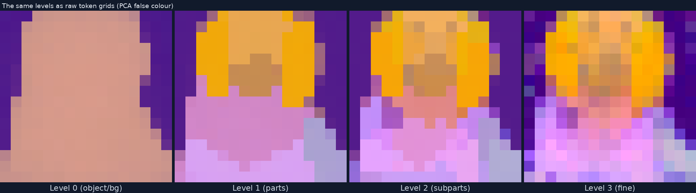
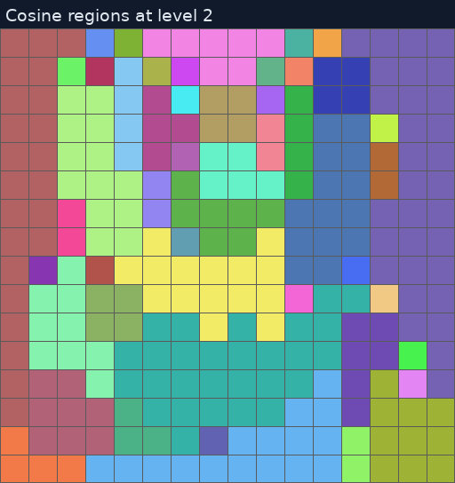

# The example workflows

Five diagrams, in reading order. Load one with **Workflow → Open**, or drag the
`.json` onto the canvas. Each carries a note on the left explaining itself.

| | what it shows | runs as-is |
|---|---|---|
| [01 · generate and decode](#01--generate-and-decode) | the method, no editing | ✅ |
| [02 · feature edit, typed](#02--feature-edit-coords) | change a region's content | ✅ |
| [03 · feature edit, painted](#03--feature-edit-painter) | the same, with a brush | two runs by design |
| [04 · shape edit](#04--shape-edit) | move a region's boundary | ✅ |
| [05 · sweep the seed](#05--sweep-seeds) | one edit across four seeds, tabulated | ✅ |

> New to ComfyUI? [**../docs/GETTING-STARTED.md**](../docs/GETTING-STARTED.md)
> covers installing and pressing Run.
> Node reference and shared conventions: [**../README.md**](../README.md).

All five are generated from the live node definitions by
`scripts/make_workflows.py`, so they cannot drift from what the nodes accept.

---

## 01 · generate and decode

Sample one trajectory and look at all four levels, decoded and as the raw token
grid.


| change | effect |
|---|---|
| *TF ImageNet Class* | which of the 1000 classes |
| *TF Generate* → `seed` | a different sample of the same class |
| *TF Latent Preview* → `which` | one level instead of all four |

The lower strip is the PCA view: the same four levels as raw tokens in false
colour. It looks abstract, but it is what the edits in 02 to 04 operate on, and
region boundaries are far easier to see there than in the decoded image.



---

## 02 · feature edit (coords)

Take the average feature of a patch of one image, write it into a region of
another, then re-sample the finer levels from there.


This is the paper's feature edit, `z̃ᵢ = f_src` for the selected tokens. Similar
content sits near itself in feature space, so writing one region's average onto
another transfers its identity. The finer levels are then re-generated rather than
pasted, which is what makes the result coherent.

Selections are `row,col` on the 16×16 token grid. `7,7` is the middle, and
`6,6:9` means row 6, columns 6 through 9. The node carries a clickable grid that
writes into that text field, so you can click or type and the two stay in step.

*target region* has a region map wired in, so one click takes the whole region and
the boundaries are drawn on the grid. *source tokens* does not, so it takes your
coordinates literally. Unwire `regions` if you want sub-region tokens.

| change | effect |
|---|---|
| *target region* → `coords` | where the edit lands |
| *source tokens* → `coords` | what gets written there |
| *TF Feature Edit* → `level` | 0 to 3. Lower is broader and more semantic. |
| *TF Feature Edit* → `strength` | below 1.0 blends instead of replacing |
| *TF Feature Edit* → `source_mode` | `region mean` is the paper's edit, `token cycle` copies token-for-token |
| either *TF Generate* → `class_id` | which two images you are mixing |

If a result surprises you, check the *what was selected* preview first. Most
surprises are the selection not being where you thought. Previews are numbered
along their edges so a coordinate can be read off.

To see whether it changed anything, *TF Compare Levels* reports tokens changed per
level and draws a heatmap. An edit at level 2 should show zero change at levels 0
and 1, the selected tokens at 2, and diffuse change at 3. Anything else is the
interesting kind of wrong.

---

## 03 · feature edit (painter)

The same edit, with the region picked by brush.

It takes two runs by design, because the graph has to run once to produce the
canvas:

1. Run. It stops at *TF Tokens From Mask*, and the canvas appears inside the Painter.
2. Paint over the area you want to change.
3. Run again.

Your stroke is snapped to whole regions, so it does not need to be neat. Covering
most of a region selects all of it.



If it still stops after you painted, the note says which threshold you missed:

| setting | meaning | change it when |
|---|---|---|
| `coverage` | fraction of a token's pixels painted | you painted too thinly |
| `region_overlap` | fraction of a region's tokens painted | your stroke spread over too many regions |

Unwire `regions` to take painted tokens literally instead of snapping, which is
useful for a deliberately ragged selection.

> If the Painter says "Node 2.0 only", see
> [README → Troubleshooting](../README.md#troubleshooting). Workflow 02 needs none
> of this.

---

## 04 · shape edit

Change where a region ends rather than what it contains. Tokens are handed to a
neighbour and take on the receiving region's average feature, so the boundary
moves and no new content is invented. This is the paper's `R_a → R_b`.

Two selections:

- **tokens to hand over**, the ones that change sides.
- **one token in the receiving region**. The whole region it names supplies the
  feature, which is what keeps the content unchanged.

They must name different regions, or the node stops and says so.

Look at the region map preview first. It is the only reliable way to pick
coordinates that straddle a boundary, since at threshold 0.9 there are around 50
regions over 256 tokens and they are not where you would guess.

Worth changing: *TF Region Map* → `cosine_threshold`. Higher splits into more,
smaller regions and lower merges them. It changes what counts as one thing, and
therefore what a shape edit can move.

---

## 05 · sweep seeds

Workflow 02's edit, four times over, to answer whether it was the edit or the
seed.

*TF Sweep Edit* runs the identical edit once per seed and, for each arm, also
re-samples the unedited canvas with that same seed. Each row is then the edit's
effect with the seed cancelled out.

```
seed         tokens changed   mean dist   max dist
592            27 / 256         0.0664     0.8485
593            24 / 256         0.0673     0.8156
594            25 / 256         0.0667     0.8456

spread across arms: 0.0270 mean pairwise cosine distance at level 3
```

**mean dist** is how far the edit moved the final level, against that arm's own
no-edit baseline. **spread across arms** is how far the arms are from each other.
Here the edit moves the result about 2.5 times as far as the seed does, so a
single-seed result from workflow 02 was worth trusting. Had the spread been
larger, it would not have been.

| change | try |
|---|---|
| `values` | any list, or `1-8` for a range. Duplicates are dropped. |
| `axis` → `level (l*)` | with `0-3`, the same edit at each level. This is the sweep Sec. 4.4 is really about, since coarser edits cascade through more re-sampling. |
| `axis` → `strength` | with `0.25,0.5,0.75,1.0`, where a blend stops being a blend |
| `output_arm` (advanced) | which arm leaves on `levels`, for the *TF Compare Levels* at the bottom |
| `arm_limit` (advanced) | refuses to start rather than let a mistyped `0-1000` hold the GPU |
| `decode` off (advanced) | contact sheet uses PCA tiles instead. Costs nothing, and the table is identical. |

Cost is two re-samples and one decode per arm. Four arms is seconds once the model
is warm, forty is a coffee.

Group 5 writes both the table (`sweep.md`) and the sheet (`sweep.png`) to
`output/trajectory_forcing/` under one name. The sheet matters more, because only
the arm named by `output_arm` leaves as a trajectory, so every other arm exists in
that image or nowhere.

<details>
<summary><b>Two axes behave specially</b></summary>

`level (l*)` is the one axis that cannot hold everything fixed, because a
selection snapped to level 2's regions is not a whole region at level 0. The node
keeps the token set fixed, which is what "the same edit at every level" has to
mean, and says so in the report rather than refusing. Use typed coordinates rather
than a snapped selection if you want the token set to be exactly what you chose.

Shape edits sweep too. Wire a *TF Region Map* into `regions` and the edit becomes
workflow 04's. `seed` and `strength` work, and `level (l*)` is refused, because a
region map describes exactly one level.
</details>

---

## Building your own

Pieces not wired into any of the five:

| node | for |
|---|---|
| **TF Tokens Combine** | union, intersect or subtract selections into one region |
| **TF Save / Load Levels** | keep a trajectory across restarts, so two edits share an identical starting image |
| **TF Levels Info** | class, seed and full edit history of a trajectory |
| **TF Level Canvas** → `view: decoded RGB` | paint against the picture instead of false-colour tokens |

Edits do not sample. *TF Feature Edit* and *TF Shape Edit* only produce the edited
canvas, and nothing happens to the image until *TF Resume From Level* runs. A
trajectory that has been edited but not resumed is marked, and *TF Decode Levels*
warns rather than showing you stale levels.

The rest of the shared behaviour, including the `pipeline` socket, `-1 = auto`,
why several frames arrive as one image, and why a selection remembers its level,
is in [README → Nodes](../README.md#nodes).
